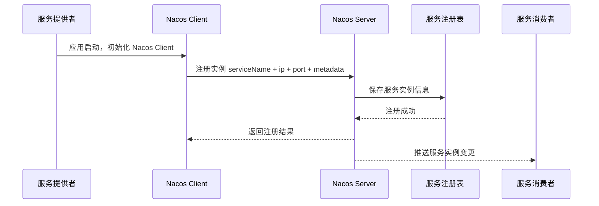
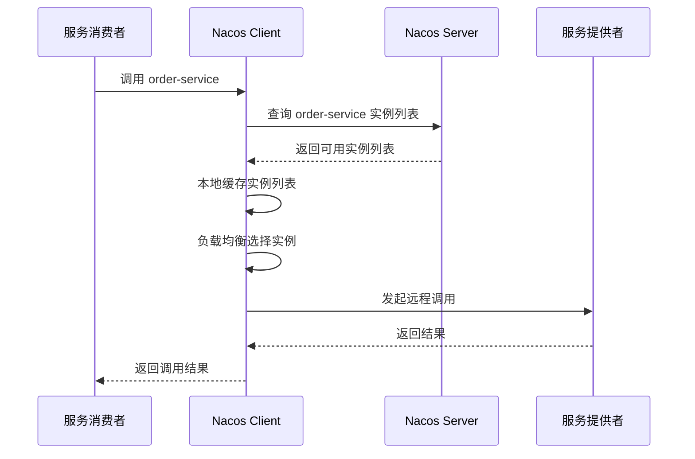
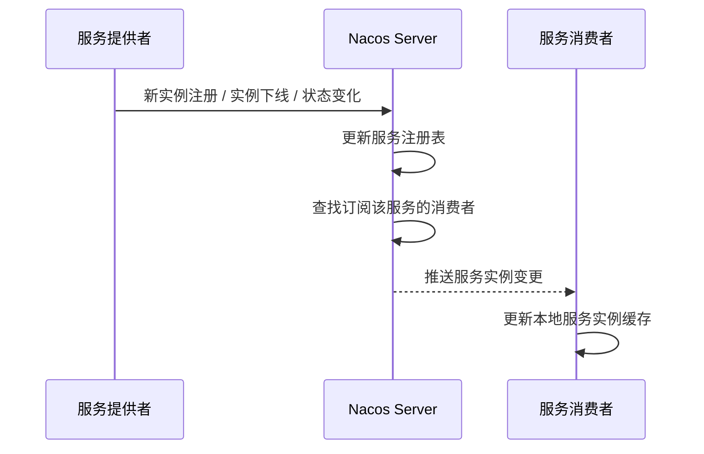
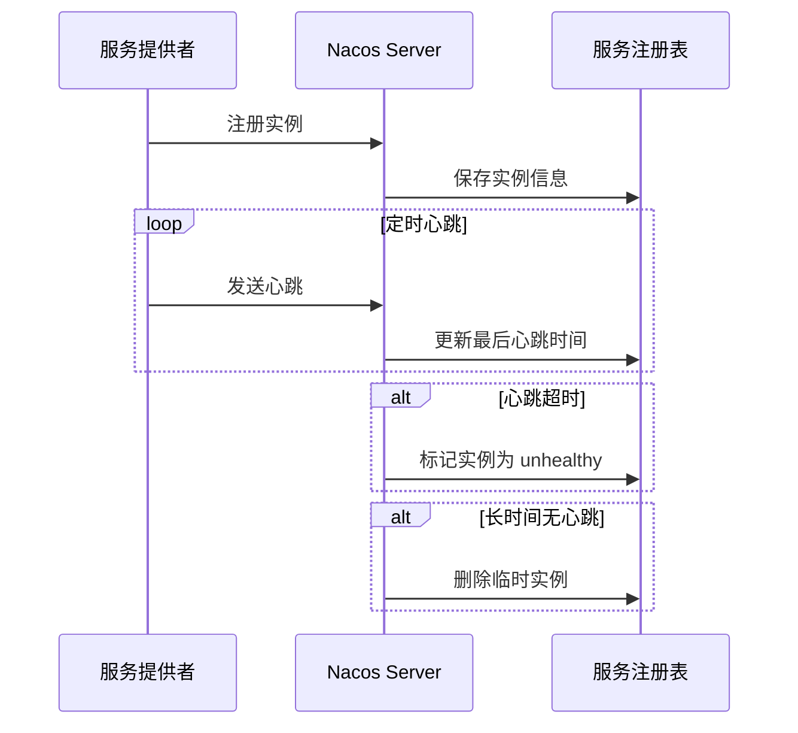
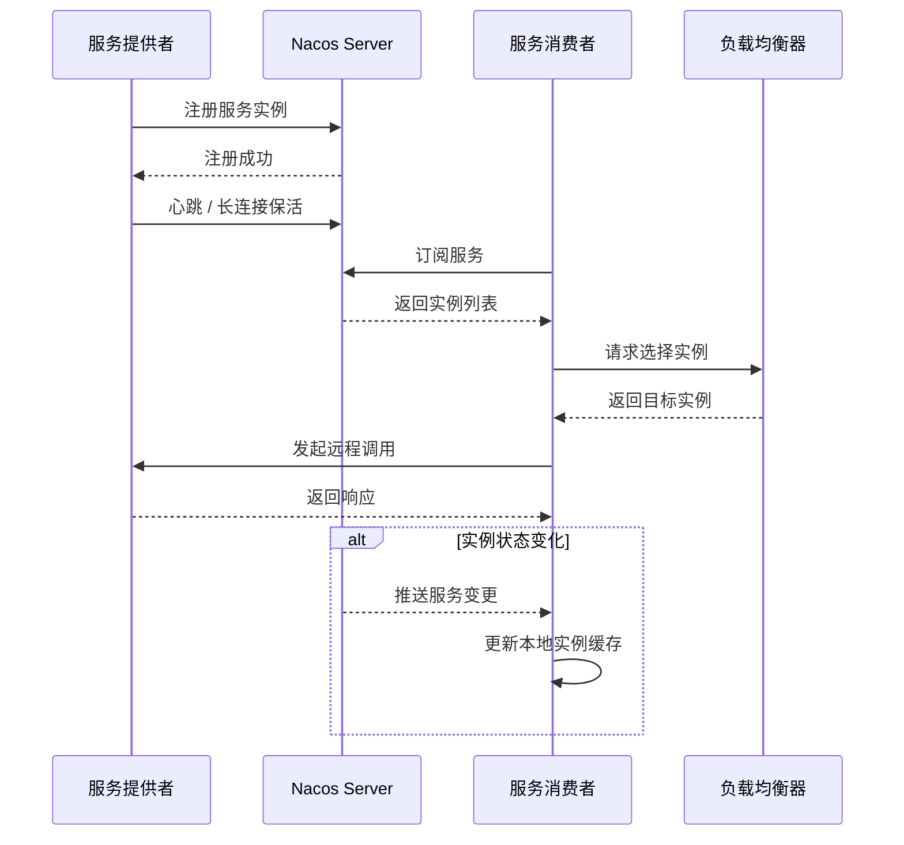

# Nacos 注册中心原理

## 1. 什么是 Nacos 注册中心？

Nacos 是一个用于 **服务发现、服务注册、配置管理和服务管理** 的平台。

在微服务架构中，Nacos 可以同时作为：

- 注册中心
- 配置中心
- 服务发现中心
- 服务元数据管理中心

其中，**Nacos 注册中心**主要负责管理服务实例的注册、发现、健康检查、上下线通知和服务元数据。

简单来说：

> Nacos 注册中心就是用来管理微服务实例地址的组件。

服务提供者启动后，会把自己的服务名、IP、端口等信息注册到 Nacos。  
服务消费者调用服务时，不需要写死 IP，而是根据服务名从 Nacos 获取可用实例列表，然后通过负载均衡选择一个实例进行调用。

---

## 2. 为什么需要注册中心？

在没有注册中心之前，服务之间调用通常需要写死地址。

例如：

```text
http://192.168.1.10:8080/order/create
http://192.168.1.11:8080/order/create
http://192.168.1.12:8080/order/create
```

这种方式存在很多问题。

---

## 3. 传统服务调用存在的问题

### 3.1 服务地址写死

如果服务地址写死在配置中，一旦服务 IP、端口发生变化，调用方就需要修改配置。

流程如下：

```text
服务地址变化
    ↓
修改调用方配置
    ↓
重新发布调用方服务
    ↓
重启应用
```

这种方式不适合微服务架构。

---

### 3.2 服务实例动态变化

微服务实例不是固定不变的。

服务实例可能因为以下原因动态变化：

- 服务启动
- 服务关闭
- 服务宕机
- 服务扩容
- 服务缩容
- 容器重启
- Pod 漂移
- 灰度发布
- 节点故障

如果没有注册中心，消费者很难实时知道哪些服务实例可用。

---

### 3.3 无法自动剔除故障节点

如果某个服务实例已经宕机，但是消费者仍然请求它，就会导致调用失败。

注册中心可以通过健康检查发现异常实例，并将其从可用实例列表中剔除。

---

### 3.4 无法统一管理服务信息

一个服务实例除了 IP 和端口之外，还可能包含很多元数据。

例如：

- 服务版本
- 实例权重
- 所属集群
- 所属机房
- 灰度标识
- 是否启用
- 是否健康
- 自定义标签

注册中心可以统一维护这些服务实例信息。

---

## 4. Nacos 注册中心解决了什么问题？

| 问题 | Nacos 的解决方式 |
|---|---|
| 服务地址写死 | 服务启动后自动注册到 Nacos |
| 服务实例动态变化 | 消费者订阅服务实例变化 |
| 服务宕机无法感知 | 通过心跳、长连接或健康检查感知 |
| 扩容缩容困难 | 新实例自动注册，旧实例自动下线 |
| 调用方维护地址复杂 | 调用方只需要知道服务名 |
| 灰度发布困难 | 支持权重、Metadata、Cluster |
| 缺少统一治理 | 支持服务管理、实例管理、健康检查 |

---

## 5. Nacos 注册中心核心模型

Nacos 注册中心中的核心模型如下：

```text
Namespace
    ↓
Group
    ↓
Service
    ↓
Cluster
    ↓
Instance
```

也可以理解为：

```text
命名空间
    ↓
服务分组
    ↓
服务
    ↓
集群
    ↓
实例
```

---

## 6. Namespace

`Namespace` 用于环境隔离。

常见划分方式：

| Namespace | 说明 |
|---|---|
| dev | 开发环境 |
| test | 测试环境 |
| pre | 预发环境 |
| prod | 生产环境 |

例如：

```text
Namespace: dev
Service: order-service

Namespace: prod
Service: order-service
```

虽然服务名都是 `order-service`，但它们属于不同的 Namespace，所以互相隔离。

---

## 7. Group

`Group` 用于服务分组。

默认分组通常是：

```text
DEFAULT_GROUP
```

可以按照业务域划分 Group。

例如：

| Group | 说明 |
|---|---|
| DEFAULT_GROUP | 默认分组 |
| USER_GROUP | 用户服务分组 |
| ORDER_GROUP | 订单服务分组 |
| PAY_GROUP | 支付服务分组 |
| COMMON_GROUP | 公共服务分组 |

完整服务名在 Nacos 内部可能类似：

```text
DEFAULT_GROUP@@order-service
```

---

## 8. Service

`Service` 表示一个服务。

例如：

```text
user-service
order-service
payment-service
inventory-service
gateway-service
```

服务消费者调用服务时，一般使用服务名，而不是具体 IP。

例如调用订单服务：

```text
order-service
```

Nacos 会返回该服务下的可用实例列表。

---

## 9. Cluster

`Cluster` 表示服务实例所属集群。

常见划分方式：

| Cluster | 说明 |
|---|---|
| DEFAULT | 默认集群 |
| BJ | 北京机房 |
| SH | 上海机房 |
| SG | 新加坡机房 |
| IDC-A | A 机房 |
| IDC-B | B 机房 |

Cluster 常用于：

- 同机房优先调用
- 跨机房容灾
- 区域化流量控制
- 就近访问
- 多活架构

---

## 10. Instance

`Instance` 表示服务实例，也就是一个具体运行中的服务进程。

一个 Service 可以有多个 Instance。

例如：

```text
Service: order-service

Instance 1: 192.168.1.10:8080
Instance 2: 192.168.1.11:8080
Instance 3: 192.168.1.12:8080
```

实例通常包含以下信息：

| 字段 | 说明 |
|---|---|
| ip | 实例 IP |
| port | 实例端口 |
| serviceName | 服务名 |
| clusterName | 所属集群 |
| weight | 权重 |
| healthy | 是否健康 |
| enabled | 是否启用 |
| ephemeral | 是否临时实例 |
| metadata | 元数据 |

---

## 11. Nacos 注册中心整体架构

```text
服务提供者 Provider
        |
        | 1. 注册服务实例
        | 2. 发送心跳 / 维持长连接
        v
Nacos Server 集群
        |
        | 3. 保存服务实例信息
        | 4. 健康检查
        | 5. 服务变更通知
        v
服务消费者 Consumer
        |
        | 6. 订阅服务
        | 7. 获取实例列表
        | 8. 本地负载均衡
        v
目标服务实例
```

---

## 12. Nacos 注册中心核心组件

| 组件 | 作用 |
|---|---|
| Nacos Client | 应用侧客户端，负责服务注册、服务发现、订阅变更 |
| Nacos Server | 注册中心服务端，负责实例管理、健康检查、变更通知 |
| Service Registry | 服务注册表，保存服务和实例映射关系 |
| Health Check | 健康检查机制，判断实例是否可用 |
| Subscriber | 服务订阅者，监听服务实例变化 |
| Local Cache | 客户端本地缓存，缓存服务实例列表 |
| LoadBalancer | 客户端负载均衡组件，选择具体实例 |

---

## 13. 服务注册原理

服务提供者启动时，会将自己的实例信息注册到 Nacos Server。

注册信息通常包括：

```text
namespace
group
serviceName
ip
port
clusterName
weight
metadata
ephemeral
```

注册成功后，Nacos Server 会把该实例保存到服务注册表中。

---

## 14. 服务注册流程

```text
服务启动
    ↓
加载 Nacos Discovery 配置
    ↓
初始化 Nacos Client
    ↓
获取当前服务 IP、端口、服务名
    ↓
向 Nacos Server 发起注册请求
    ↓
Nacos Server 保存服务实例
    ↓
实例进入服务注册表
    ↓
通知订阅该服务的消费者
```

---

## 15. 服务注册流程图



---

## 16. Spring Cloud Alibaba 接入 Nacos 注册中心

### 16.1 引入依赖

```xml
<dependency>
    <groupId>com.alibaba.cloud</groupId>
    <artifactId>spring-cloud-starter-alibaba-nacos-discovery</artifactId>
</dependency>
```

---

### 16.2 配置 Nacos 地址

```yaml
spring:
  application:
    name: order-service

  cloud:
    nacos:
      discovery:
        server-addr: 127.0.0.1:8848
        namespace: dev
        group: DEFAULT_GROUP
        cluster-name: DEFAULT
        weight: 1
        metadata:
          version: v1
          gray: false
```

---

### 16.3 启动类开启服务发现

```java
import org.springframework.boot.SpringApplication;
import org.springframework.boot.autoconfigure.SpringBootApplication;
import org.springframework.cloud.client.discovery.EnableDiscoveryClient;

@EnableDiscoveryClient
@SpringBootApplication
public class OrderServiceApplication {

    public static void main(String[] args) {
        SpringApplication.run(OrderServiceApplication.class, args);
    }
}
```

说明：

- `@EnableDiscoveryClient` 用于开启服务发现能力。
- 在部分新版本 Spring Cloud 中，即使不显式添加该注解，也可以通过自动装配完成服务注册。
- 显式添加可以让代码意图更加清晰。

---

## 17. 服务发现原理

服务消费者调用服务时，不需要写死 IP，而是通过服务名向 Nacos 查询可用实例。

例如消费者调用：

```text
order-service
```

Nacos 返回：

```text
192.168.1.10:8080
192.168.1.11:8080
192.168.1.12:8080
```

消费者拿到实例列表后，通过本地负载均衡选择一个实例进行调用。

---

## 18. 服务发现流程

```text
消费者启动
    ↓
初始化 Nacos Client
    ↓
订阅目标服务
    ↓
从 Nacos Server 拉取实例列表
    ↓
缓存到消费者本地
    ↓
调用服务时从本地实例列表选择实例
    ↓
发起远程调用
```

---

## 19. 服务发现流程图



---

## 20. 服务订阅原理

服务消费者不仅会查询服务实例列表，还会订阅服务变更。

当服务实例发生变化时，Nacos 会通知消费者更新本地缓存。

常见变更包括：

- 新实例上线
- 实例主动下线
- 实例异常宕机
- 实例健康状态变化
- 实例权重变化
- 实例 Metadata 变化
- 实例 enabled 状态变化

---

## 21. 服务变更通知流程

```text
服务实例发生变化
    ↓
Nacos Server 更新服务注册表
    ↓
查找订阅该服务的客户端
    ↓
推送服务变更事件
    ↓
消费者更新本地实例缓存
    ↓
后续调用使用新的实例列表
```

---

## 22. 服务变更通知流程图



---

## 23. 健康检查原理

注册中心需要判断服务实例是否健康。

健康检查的目标是：

> 避免消费者调用已经不可用的服务实例。

Nacos 会根据心跳、连接状态或主动探测判断实例健康状态。

实例健康状态通常有两种：

```text
healthy = true
healthy = false
```

---

## 24. 健康检查方式

Nacos 常见健康检查方式包括：

| 健康检查方式 | 说明 |
|---|---|
| 心跳上报 | 客户端定期向 Nacos 上报自己还活着 |
| TCP 检查 | Nacos Server 检查实例端口是否可连接 |
| HTTP 检查 | Nacos Server 调用实例健康检查接口 |
| gRPC 长连接 | Nacos 2.x 通过长连接感知客户端状态 |
| 自定义检查 | 根据业务协议自定义健康判断 |

---

## 25. 临时实例和持久实例

Nacos 中的服务实例分为两类：

```text
临时实例 ephemeral = true
持久实例 ephemeral = false
```

---

## 26. 临时实例

临时实例是微服务中最常用的实例类型。

特点：

| 特点 | 说明 |
|---|---|
| 默认常用 | Spring Cloud 微服务通常使用临时实例 |
| 依赖心跳或连接保活 | 用来判断实例是否存活 |
| 异常后自动剔除 | 服务宕机后会被自动删除 |
| 更关注可用性 | 更适合动态上下线场景 |
| 通常偏 AP | 优先保证可用性 |

适合场景：

- Spring Cloud 微服务
- Dubbo 服务
- 容器化应用
- Kubernetes Pod
- 动态扩缩容服务

---

## 27. 持久实例

持久实例适合相对固定的服务节点。

特点：

| 特点 | 说明 |
|---|---|
| 实例信息持久化 | 实例不会因为短暂不可用就消失 |
| 更关注一致性 | 适合固定节点管理 |
| 异常时标记不健康 | 不一定直接删除实例 |
| 通常偏 CP | 优先保证一致性 |

适合场景：

- 固定 IP 服务
- 传统虚拟机部署服务
- 手工维护的服务节点
- 对实例信息稳定性要求较高的服务

---

## 28. 临时实例和持久实例对比

| 对比项 | 临时实例 | 持久实例 |
|---|---|---|
| ephemeral | true | false |
| 是否常用于微服务 | 是 | 较少 |
| 是否自动剔除 | 是 | 通常不直接删除 |
| 健康判断 | 心跳 / 长连接 | 服务端主动检查 |
| 一致性倾向 | AP | CP |
| 适用场景 | 动态微服务实例 | 固定服务实例 |

---

## 29. 心跳机制原理

服务提供者注册成功后，需要持续告诉 Nacos：

```text
我还活着
```

这个动作就是心跳。

心跳大致流程：

```text
服务注册成功
    ↓
客户端定时发送心跳
    ↓
Nacos Server 更新最后心跳时间
    ↓
如果超过一段时间没有收到心跳
    ↓
标记实例为不健康
    ↓
如果继续超时
    ↓
删除临时实例
```

---

## 30. 心跳机制流程图



---

## 31. Nacos 2.x 长连接模型

Nacos 2.x 引入了基于 gRPC 的长连接模型。

相比早期 HTTP 短连接模型，长连接模型有以下优势：

| 优势 | 说明 |
|---|---|
| 降低请求开销 | 减少频繁 HTTP 请求 |
| 推送更及时 | 服务变更可以通过长连接推送 |
| 连接状态可感知 | 服务端可以感知客户端断开 |
| 降低服务端压力 | 减少大量心跳和查询请求 |
| 更适合大规模服务 | 支持更多服务实例和客户端连接 |

Nacos 2.x 中，客户端和服务端之间可以通过长连接维持通信，用于注册、订阅和服务变更推送。

---

## 32. Nacos 1.x 和 2.x 通信模型对比

| 对比项 | Nacos 1.x | Nacos 2.x |
|---|---|---|
| 主要通信方式 | HTTP 短连接 | gRPC 长连接 |
| 服务变更通知 | UDP 推送 + 查询补偿 | 长连接推送 |
| 连接模型 | 请求级连接 | 客户端长连接 |
| 心跳方式 | 周期性心跳请求 | 长连接保活 |
| 服务端压力 | 相对较高 | 相对较低 |
| 实时性 | 较好 | 更好 |
| 适合规模 | 中小规模 | 更适合大规模 |

---

## 33. 服务下线原理

服务下线分为两种情况：

```text
主动下线
被动下线
```

---

## 34. 主动下线

服务正常关闭时，Nacos Client 会向 Nacos Server 发送注销请求。

流程如下：

```text
应用准备关闭
    ↓
Nacos Client 发送注销请求
    ↓
Nacos Server 删除实例
    ↓
通知订阅者实例下线
    ↓
消费者更新本地缓存
```

---

## 35. 被动下线

如果服务异常宕机，无法主动发送注销请求。

这时 Nacos 会依赖心跳超时、健康检查失败或长连接断开来判断服务异常。

流程如下：

```text
服务异常宕机
    ↓
Nacos Server 收不到心跳或感知连接断开
    ↓
标记实例为不健康
    ↓
临时实例继续超时后被删除
    ↓
通知消费者更新实例列表
```

---

## 36. 服务消费者本地缓存

服务消费者从 Nacos 获取服务实例列表后，会缓存在本地。

本地缓存的作用：

| 作用 | 说明 |
|---|---|
| 提高调用性能 | 调用时不需要每次都请求 Nacos |
| 降低注册中心压力 | 减少频繁查询 |
| 提高系统可用性 | Nacos 短暂不可用时仍可使用旧实例 |
| 支持本地负载均衡 | 直接从本地实例列表选择节点 |

---

## 37. 消费者调用流程

```text
消费者调用服务
    ↓
从本地缓存获取实例列表
    ↓
过滤不可用实例
    ↓
通过负载均衡选择一个实例
    ↓
发起远程调用
    ↓
返回调用结果
```

---

## 38. 客户端负载均衡原理

Nacos 主要负责服务注册和服务发现。

真正调用服务时，通常由客户端负载均衡组件选择一个实例。

常见负载均衡策略：

| 策略 | 说明 |
|---|---|
| 随机 | 随机选择一个实例 |
| 轮询 | 按顺序轮流选择实例 |
| 权重随机 | 根据实例权重分配流量 |
| 最小连接数 | 优先选择连接较少的实例 |
| 同集群优先 | 优先选择同 Cluster 实例 |
| 灰度路由 | 根据 metadata 选择实例 |

---

## 39. 权重 Weight

权重用于控制实例被调用的概率。

例如：

```text
Instance A: weight = 1
Instance B: weight = 2
Instance C: weight = 7
```

理论流量比例接近：

```text
A : B : C = 1 : 2 : 7
```

适用场景：

- 机器性能不同
- 灰度发布
- 新版本小流量验证
- 老版本大流量承接
- 故障实例降低权重
- 流量动态调节

---

## 40. Metadata 元数据

Metadata 是服务治理中非常重要的能力。

实例可以携带自定义元数据。

例如：

```yaml
version: v1
gray: true
region: singapore
zone: sg-a
env: prod
protocol: http
```

常见用途：

| 用途 | 示例 |
|---|---|
| 灰度发布 | 只调用 `gray=true` 的实例 |
| 版本路由 | 只调用 `version=v2` 的实例 |
| 区域路由 | 优先调用 `region=singapore` 的实例 |
| 标签路由 | 根据业务标签选择实例 |
| 租户隔离 | 不同租户调用不同实例 |
| 协议区分 | HTTP、Dubbo、gRPC 分流 |

---

## 41. 保护阈值 Protect Threshold

保护阈值用于避免服务雪崩。

假设一个服务有 10 个实例，其中只有 2 个实例健康。

如果 Nacos 只返回这 2 个健康实例，所有流量都会集中到这 2 个实例上，可能导致它们也被压垮。

保护阈值的作用是：

> 当健康实例比例过低时，Nacos 可能返回更多实例，避免流量全部压到少数健康实例上。

---

## 42. 保护阈值示例

假设：

```text
总实例数：10
健康实例数：2
健康比例：20%
保护阈值：0.5
```

判断：

```text
0.2 < 0.5
```

说明健康实例比例低于保护阈值。

此时 Nacos 可能会返回更多实例，包括部分不健康实例，以避免流量集中到少量健康实例上。

---

## 43. Nacos 注册中心集群原理

生产环境中，Nacos 通常采用集群部署。

典型架构如下：

```text
              ┌──────────────┐
              │   SLB / VIP  │
              └──────┬───────┘
                     │
      ┌──────────────┼──────────────┐
      │              │              │
┌─────▼─────┐  ┌─────▼─────┐  ┌─────▼─────┐
│ Nacos-1   │  │ Nacos-2   │  │ Nacos-3   │
└─────┬─────┘  └─────┬─────┘  └─────┬─────┘
      │              │              │
      └──────────────┼──────────────┘
                     │
              服务实例数据同步
```

---

## 44. 为什么注册中心需要集群？

| 目的 | 说明 |
|---|---|
| 高可用 | 单个 Nacos 节点宕机不影响服务发现 |
| 负载均衡 | 多个节点分摊注册和查询压力 |
| 容灾 | 部分节点异常时，其他节点继续提供服务 |
| 数据同步 | 服务实例变化需要同步到其他节点 |
| 避免单点故障 | 注册中心不能成为系统单点 |
| 支撑大规模实例 | 多节点承载更多服务和客户端连接 |

---

## 45. Nacos 注册中心一致性原理

注册中心需要在两个目标之间做平衡：

```text
可用性 AP
一致性 CP
```

在微服务场景中，服务实例上下线非常频繁，尤其是容器化部署时，实例变化更加频繁。

因此，Nacos 针对不同类型的实例采用不同的一致性策略：

| 实例类型 | 一致性倾向 |
|---|---|
| 临时实例 | AP |
| 持久实例 | CP |

---

## 46. AP 模式

AP 模式关注：

```text
Availability 可用性
Partition Tolerance 分区容错性
```

特点：

| 特点 | 说明 |
|---|---|
| 优先保证可用 | 网络分区时仍尽量提供服务 |
| 最终一致 | 节点之间可能短暂不一致 |
| 适合临时实例 | 微服务实例频繁上下线 |
| 容错能力强 | 更适合大规模动态注册场景 |

临时实例通常更适合 AP 模式。

---

## 47. CP 模式

CP 模式关注：

```text
Consistency 一致性
Partition Tolerance 分区容错性
```

特点：

| 特点 | 说明 |
|---|---|
| 优先保证一致性 | 数据变更需要强一致保障 |
| 可用性可能降低 | 网络分区时可能拒绝部分写入 |
| 适合持久实例 | 固定节点、稳定服务信息 |
| 数据可靠性更强 | 更适合关键服务实例管理 |

持久实例通常更适合 CP 模式。

---

## 48. Distro 和 Raft

Nacos 注册中心底层涉及两类一致性协议或同步机制：

| 机制 | 说明 |
|---|---|
| Distro | 偏 AP，用于临时实例数据同步 |
| Raft | 偏 CP，用于持久实例数据同步 |

简单理解：

```text
临时实例 —— Distro —— AP
持久实例 —— Raft —— CP
```

---

## 49. 服务调用完整流程

一个完整的服务调用流程如下：

```text
1. 服务提供者启动
2. 服务提供者注册到 Nacos
3. Nacos 保存实例信息
4. 服务提供者发送心跳或维持长连接
5. 服务消费者启动
6. 服务消费者订阅目标服务
7. Nacos 返回服务实例列表
8. 消费者缓存实例列表
9. 消费者通过负载均衡选择实例
10. 消费者发起远程调用
11. 服务提供者返回响应
12. 如果实例变化，Nacos 推送变更
13. 消费者更新本地缓存
```

---

## 50. 服务调用完整流程图



---

## 51. Nacos 注册中心和配置中心区别

| 对比项 | 注册中心 | 配置中心 |
|---|---|---|
| 核心职责 | 管理服务实例 | 管理应用配置 |
| 管理对象 | 服务、实例、IP、端口、健康状态 | 配置文件、配置项 |
| 典型功能 | 服务注册、服务发现、健康检查 | 配置发布、动态刷新、回滚 |
| 客户端行为 | 注册实例、订阅服务 | 拉取配置、监听配置变化 |
| 变化频率 | 实例上下线频繁 | 配置变更相对较少 |
| 核心关注点 | 服务可用性 | 配置一致性 |

---

## 52. Eureka、Zookeeper、Nacos 对比

| 对比项 | Eureka | Zookeeper | Nacos |
|---|---|---|---|
| 类型 | 注册中心 | 分布式协调组件 | 注册中心 + 配置中心 |
| 一致性倾向 | AP | CP | AP + CP |
| 健康检查 | 心跳 | 临时节点 | 心跳 / 长连接 / 主动检查 |
| 配置中心 | 不支持 | 可实现但不专用 | 原生支持 |
| 服务治理 | 较弱 | 需要扩展 | 较丰富 |
| 动态配置 | 不支持 | 不方便 | 支持 |
| 适合场景 | Spring Cloud 老项目 | 强一致协调场景 | 微服务注册发现和配置管理 |

---

## 53. Nacos 注册中心常见配置

```yaml
spring:
  application:
    name: order-service

  cloud:
    nacos:
      discovery:
        server-addr: 127.0.0.1:8848
        namespace: dev
        group: DEFAULT_GROUP
        cluster-name: DEFAULT
        weight: 1
        metadata:
          version: v1
          gray: false
          region: singapore
```

---

## 54. 配置项说明

| 配置 | 说明 |
|---|---|
| `spring.application.name` | 服务名 |
| `server-addr` | Nacos Server 地址 |
| `namespace` | 命名空间 |
| `group` | 服务分组 |
| `cluster-name` | 集群名称 |
| `weight` | 实例权重 |
| `metadata` | 实例元数据 |

---

## 55. Nacos 注册中心最佳实践

### 55.1 服务名规范

推荐使用小写中划线格式：

```text
user-service
order-service
payment-service
inventory-service
```

不推荐：

```text
UserService
user_service
userservice
```

---

### 55.2 Namespace 按环境隔离

推荐：

```text
dev
test
pre
prod
```

不要把测试环境和生产环境服务注册到同一个 Namespace。

---

### 55.3 Group 按业务域划分

推荐：

```text
USER_GROUP
ORDER_GROUP
PAYMENT_GROUP
COMMON_GROUP
```

---

### 55.4 Cluster 按区域或机房划分

推荐：

```text
BJ
SH
SG
IDC-A
IDC-B
```

这样可以支持：

- 同机房优先调用
- 跨机房容灾
- 多地域部署
- 就近访问

---

### 55.5 合理设置权重

权重可以用于灰度发布和流量控制。

例如：

```text
老版本实例 weight = 100
新版本实例 weight = 5
```

这样可以让新版本先承接少量流量。

---

### 55.6 使用 Metadata 做灰度路由

示例：

```yaml
spring:
  cloud:
    nacos:
      discovery:
        metadata:
          version: v2
          gray: true
```

消费者可以根据 metadata 做路由判断：

```text
只调用 version=v2 的实例
只调用 gray=true 的实例
优先调用同 region 的实例
```

---

### 55.7 生产环境部署 Nacos 集群

生产环境不建议单机部署 Nacos。

建议：

```text
至少 3 个 Nacos 节点
前面挂 SLB / VIP
配置合理 JVM 参数
开启认证和权限控制
接入监控和告警
定期备份重要数据
```

---

### 55.8 消费者要做好容错

即使注册中心返回了健康实例，调用时仍然可能失败。

消费者应该做好：

- 超时控制
- 重试机制
- 熔断降级
- 限流保护
- 失败实例隔离
- 连接池管理

---

## 56. 常见问题

### 56.1 服务注册不上去怎么办？

常见原因：

- Nacos Server 地址配置错误
- Namespace 配置错误
- Group 配置错误
- 服务名为空
- 网络不通
- Nacos 认证失败
- 版本依赖不兼容
- 没有引入 discovery starter
- 应用启动失败
- 防火墙或安全组未放行端口

---

### 56.2 服务能注册，但消费者发现不了？

常见原因：

- 消费者和提供者不在同一个 Namespace
- 消费者和提供者 Group 不一致
- 服务名写错
- 实例不健康
- 实例被 disabled
- 消费者本地缓存未刷新
- 负载均衡配置异常
- 权限或认证配置问题

---

### 56.3 服务下线后为什么还能被调用？

可能原因：

- 消费者本地缓存还没有刷新
- 实例还没有被 Nacos 判定为不健康
- 客户端存在重试机制
- 负载均衡缓存未更新
- 健康检查超时时间较长
- 网络分区导致状态同步延迟
- 服务虽然下线，但连接还未完全断开

---

### 56.4 为什么 Nacos 控制台看到实例不健康？

可能原因：

- 应用已经宕机
- 应用和 Nacos 网络不通
- 心跳丢失
- 服务端口不可访问
- 健康检查接口异常
- CPU 或 GC 导致心跳延迟
- 容器资源不足
- 应用刚启动但还未完全 ready

---

### 56.5 Nacos 挂了，服务之间还能调用吗？

如果消费者本地已经缓存了服务实例列表，短时间内通常还能继续调用。

但是：

- 新服务无法注册
- 新实例无法被发现
- 实例变化无法及时同步
- 本地缓存可能逐渐过期
- 长时间不可用会影响服务治理能力

所以生产环境必须部署 Nacos 集群。

---

## 57. 面试回答版本

如果面试官问：**Nacos 注册中心原理是什么？**

可以这样回答：

> Nacos 注册中心主要用于微服务的服务注册和服务发现。服务提供者启动时，会通过 Nacos Client 将自己的服务名、IP、端口、权重、Cluster、Metadata 等实例信息注册到 Nacos Server。Nacos Server 会维护服务和实例之间的映射关系，并通过心跳、健康检查或长连接保活机制判断实例是否健康。服务消费者启动后，会根据服务名从 Nacos 获取实例列表并缓存在本地，调用时通过客户端负载均衡选择一个实例进行远程调用。当服务实例上线、下线或健康状态发生变化时，Nacos 会通知订阅该服务的消费者更新本地缓存。Nacos 同时支持临时实例和持久实例，临时实例偏 AP，适合动态微服务场景；持久实例偏 CP，适合固定节点和强一致场景。

---

## 58. 核心流程总结

Nacos 注册中心核心流程如下：

```text
服务提供者启动
    ↓
注册实例到 Nacos
    ↓
Nacos 保存服务实例信息
    ↓
服务提供者发送心跳或维持长连接
    ↓
Nacos 判断实例健康状态
    ↓
服务消费者订阅服务
    ↓
消费者获取实例列表并本地缓存
    ↓
消费者通过负载均衡选择实例
    ↓
发起远程调用
    ↓
服务实例变化后 Nacos 推送变更
    ↓
消费者更新本地缓存
```

---

## 59. 一句话总结

> Nacos 注册中心通过服务注册、服务发现、健康检查、服务订阅、变更推送、本地缓存、客户端负载均衡和集群数据同步，实现了微服务实例的动态管理和可靠调用。
