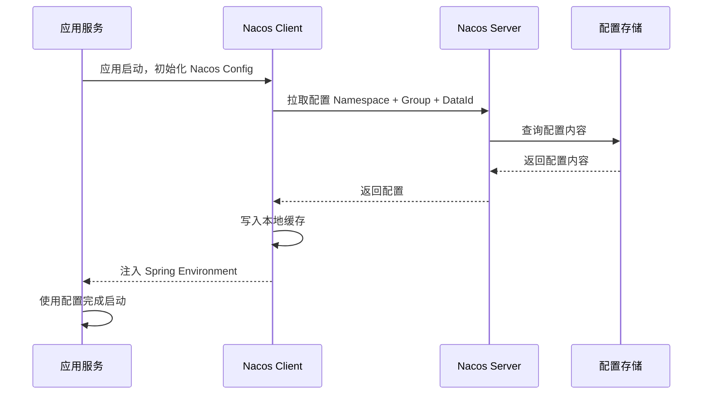
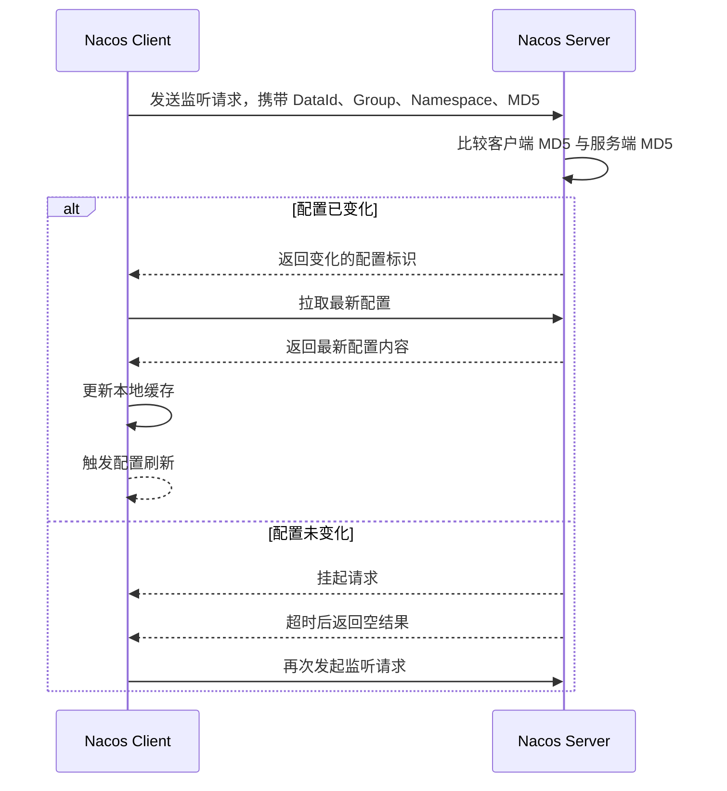
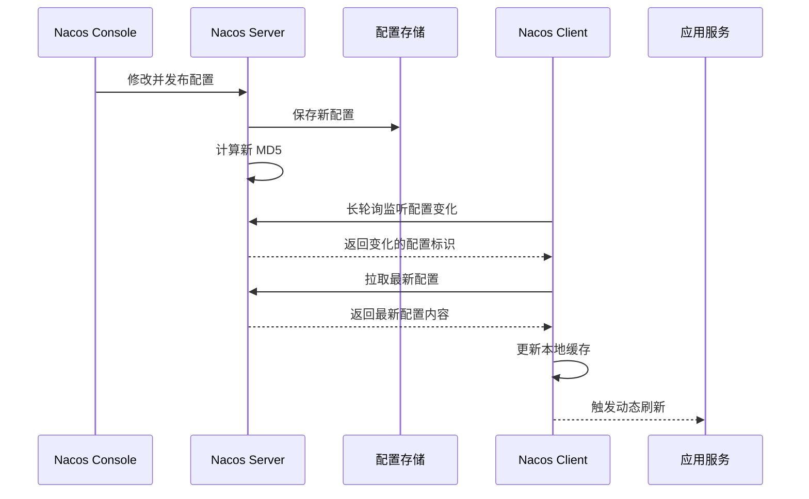

# Nacos 配置中心原理

## 1. 什么是 Nacos 配置中心？

Nacos 是阿里巴巴开源的一个动态服务发现、配置管理和服务管理平台。

在微服务架构中，Nacos 常用作：

- 注册中心
- 配置中心
- 服务发现组件
- 服务元数据管理组件

其中，**Nacos 配置中心**主要用于统一管理应用配置，让应用可以在不重新打包、不重新部署的情况下，动态获取和刷新配置。

简单来说：

> Nacos 配置中心就是把原来写在 `application.yml`、`application.properties` 中的配置，统一放到 Nacos 服务端集中管理。

---

## 2. 为什么需要配置中心？

在传统项目中，配置通常写在本地文件中，例如：

```yaml
application.yml
application-dev.yml
application-prod.yml
```

这种方式存在一些问题。

### 2.1 配置分散

每个服务都有自己的配置文件。

当服务数量变多后，配置会分散在不同项目、不同服务器中，维护成本很高。

---

### 2.2 修改配置需要重新部署

如果配置写死在本地文件中，修改配置后通常需要：

```text
修改配置文件
    ↓
重新打包
    ↓
重新部署
    ↓
重启服务
```

这对生产环境非常不友好。

---

### 2.3 缺少统一管理

本地配置不方便统一查看、修改、审计和回滚。

例如：

- 谁修改了配置？
- 什么时间修改的？
- 修改前后差异是什么？
- 配置改错后如何快速恢复？

这些问题在本地配置文件中都不好解决。

---

### 2.4 不适合动态开关

很多业务配置希望运行时动态调整，例如：

- 日志级别
- 限流开关
- 熔断开关
- 活动开关
- 灰度开关
- 脱敏规则
- 线程池参数
- 业务策略参数

如果没有配置中心，就需要频繁重启应用。

---

## 3. Nacos 配置中心解决了什么问题？

Nacos 配置中心主要解决以下问题：

| 问题 | Nacos 的解决方式 |
|---|---|
| 配置分散 | 配置统一放到 Nacos 管理 |
| 修改配置需要重启 | 支持动态刷新 |
| 多环境配置混乱 | 使用 Namespace 隔离环境 |
| 配置无法分组 | 使用 Group 管理配置分组 |
| 配置无法回滚 | 支持历史版本和回滚 |
| 配置变更不透明 | 支持配置变更记录 |
| 生产配置风险高 | 支持权限控制、灰度发布 |

---

## 4. Nacos 配置中心核心模型

Nacos 中一份配置主要由三个核心字段确定：

```text
Namespace + Group + DataId
```

这三个字段可以唯一定位一份配置。

---

## 5. Namespace

`Namespace` 用于做环境隔离。

常见用法是按照环境划分：

| Namespace | 说明 |
|---|---|
| dev | 开发环境 |
| test | 测试环境 |
| pre | 预发环境 |
| prod | 生产环境 |

例如：

```text
Namespace: dev
DataId: order-service.yml

Namespace: prod
DataId: order-service.yml
```

虽然两个配置的 `DataId` 都是 `order-service.yml`，但是因为 Namespace 不同，所以它们是两份完全独立的配置。

---

## 6. Group

`Group` 用于配置分组。

默认分组是：

```text
DEFAULT_GROUP
```

实际项目中，可以按照业务或配置类型划分 Group。

例如：

| Group | 说明 |
|---|---|
| DEFAULT_GROUP | 默认分组 |
| ORDER_GROUP | 订单服务配置 |
| USER_GROUP | 用户服务配置 |
| COMMON_GROUP | 公共配置 |
| SENTINEL_GROUP | 限流熔断配置 |
| LOG_GROUP | 日志相关配置 |

示例：

```text
Namespace: prod
Group: ORDER_GROUP
DataId: order-service.yml
```

---

## 7. DataId

`DataId` 是配置文件的唯一标识，通常可以理解为配置文件名。

常见格式：

```text
order-service.yml
user-service.yml
gateway-service.yml
application-common.yml
log-desensitize.yml
```

在 Spring Cloud Alibaba 中，默认情况下，Nacos 会根据应用名自动拼接 DataId。

例如：

```yaml
spring:
  application:
    name: order-service
  cloud:
    nacos:
      config:
        file-extension: yaml
```

默认加载的配置可能是：

```text
order-service.yaml
```

---

## 8. Nacos 配置中心整体架构

Nacos 配置中心主要包含以下几个部分：

```text
应用服务
   |
   | 启动时拉取配置
   | 运行时监听配置变化
   v
Nacos Client
   |
   | HTTP 长轮询
   v
Nacos Server
   |
   | 配置读取、发布、监听、通知
   v
配置存储
```

---

## 9. 核心组件说明

| 组件 | 作用 |
|---|---|
| Nacos Client | 应用侧客户端，负责拉取配置、监听配置变化 |
| Nacos Server | 配置中心服务端，负责配置管理、变更通知 |
| Nacos Console | Web 控制台，提供配置编辑、发布、回滚等能力 |
| Config Storage | 配置存储，保存配置内容和历史记录 |
| Listener | 客户端监听器，用于监听配置变化 |
| Local Cache | 客户端本地缓存，用于容灾和快速读取 |

---

## 10. 应用启动时配置加载流程

应用启动时，Nacos Client 会从 Nacos Server 拉取配置。

整体流程如下：

```text
应用启动
    ↓
初始化 Nacos Client
    ↓
根据 Namespace、Group、DataId 查询配置
    ↓
Nacos Server 返回配置内容
    ↓
客户端写入本地缓存
    ↓
配置注入 Spring Environment
    ↓
应用使用配置完成启动
```

---

## 11. 启动加载流程图



---

## 12. 配置动态刷新原理

Nacos 配置中心支持配置动态刷新。

也就是说，当用户在 Nacos 控制台修改配置后，应用可以自动感知配置变化，并重新加载新配置。

核心原理是：

> 客户端通过长轮询机制监听配置变化。

---

## 13. 什么是长轮询？

长轮询是一种客户端和服务端之间保持近实时通信的方式。

它不是简单的普通轮询。

### 13.1 普通轮询

普通轮询是客户端每隔固定时间请求一次服务端。

例如：

```text
每 5 秒请求一次 Nacos Server
```

缺点是：

- 配置不变时也会频繁请求
- 浪费网络资源
- 服务端压力较大
- 实时性和性能难以兼顾

---

### 13.2 长轮询

长轮询的方式是：

```text
客户端发起请求
    ↓
服务端如果发现配置没有变化，就先挂起请求
    ↓
如果配置发生变化，服务端立即返回
    ↓
如果长时间没有变化，服务端超时返回空结果
    ↓
客户端再次发起下一次监听请求
```

这样可以兼顾：

- 实时性
- 性能
- 服务端压力
- 客户端资源消耗

---

## 14. Nacos 长轮询流程

```text
客户端发送监听请求
    ↓
请求中携带当前配置的 MD5
    ↓
服务端比较客户端 MD5 和服务端最新 MD5
    ↓
如果 MD5 不一致，说明配置发生变化
    ↓
服务端立即返回变化的 DataId
    ↓
客户端重新拉取最新配置
    ↓
更新本地缓存
    ↓
触发应用刷新
```

---

## 15. 长轮询流程图



---

## 16. 配置发布流程

当用户在 Nacos 控制台修改配置并点击发布时，大致流程如下：

```text
用户修改配置
    ↓
点击发布
    ↓
Nacos Server 保存新配置
    ↓
更新配置 MD5
    ↓
记录配置变更历史
    ↓
通知监听该配置的客户端
    ↓
客户端重新拉取最新配置
    ↓
应用刷新配置
```

---

## 17. 配置发布流程图



---

## 18. MD5 在配置监听中的作用

Nacos 会为配置内容计算 MD5。

客户端监听配置变化时，会把自己当前配置的 MD5 传给服务端。

服务端拿到后进行比较：

| 比较结果 | 含义 | 处理方式 |
|---|---|---|
| MD5 相同 | 配置没有变化 | 请求挂起或返回空 |
| MD5 不同 | 配置发生变化 | 返回变化的配置标识 |

MD5 的作用是快速判断配置是否发生变化。

---

## 19. 客户端本地缓存机制

Nacos Client 会在本地保存一份配置缓存。

本地缓存的作用：

| 作用 | 说明 |
|---|---|
| 容灾 | Nacos Server 不可用时，可以使用旧配置 |
| 提升性能 | 避免频繁远程读取配置 |
| 快速启动 | 部分场景下可以使用本地缓存启动 |
| 降低依赖 | 减少对配置中心的强依赖 |

---

## 20. 本地缓存流程

```text
首次从 Nacos Server 拉取配置
    ↓
写入客户端本地缓存
    ↓
后续配置发生变化
    ↓
客户端重新拉取最新配置
    ↓
覆盖本地缓存
```

需要注意：

> 本地缓存只是兜底和容灾手段，配置的最终来源仍然是 Nacos Server。

---

## 21. Spring Boot 集成 Nacos 配置中心

在 Spring Boot 项目中，通常通过 Spring Cloud Alibaba 集成 Nacos。

### 21.1 引入依赖

示例：

```xml
<dependency>
    <groupId>com.alibaba.cloud</groupId>
    <artifactId>spring-cloud-starter-alibaba-nacos-config</artifactId>
</dependency>
```

---

### 21.2 配置 Nacos 地址

在较新的 Spring Boot / Spring Cloud Alibaba 项目中，可以使用 `spring.config.import`。

示例：

```yaml
spring:
  application:
    name: order-service

  config:
    import:
      - optional:nacos:order-service.yml

  cloud:
    nacos:
      server-addr: 127.0.0.1:8848
      config:
        namespace: dev
        group: DEFAULT_GROUP
        file-extension: yml
```

旧版本项目中，也可能使用 `bootstrap.yml`。

示例：

```yaml
spring:
  application:
    name: order-service

  cloud:
    nacos:
      config:
        server-addr: 127.0.0.1:8848
        namespace: dev
        group: DEFAULT_GROUP
        file-extension: yaml
```

---

## 22. 使用 `@Value` 读取配置

示例配置：

```yaml
user:
  name: zhangsan
```

Java 代码：

```java
@RestController
@RefreshScope
public class UserController {

    @Value("${user.name}")
    private String userName;

    @GetMapping("/user/name")
    public String getUserName() {
        return userName;
    }
}
```

说明：

- `@Value` 可以读取配置值
- 如果希望动态刷新，通常需要配合 `@RefreshScope`
- 不适合管理大量结构化配置

---

## 23. 使用 `@ConfigurationProperties` 读取配置

推荐使用 `@ConfigurationProperties` 管理结构化配置。

示例配置：

```yaml
log:
  desensitize:
    enabled: true
    fields:
      - phone
      - idCard
      - email
```

Java 配置类：

```java
import lombok.Data;
import org.springframework.boot.context.properties.ConfigurationProperties;
import org.springframework.stereotype.Component;

import java.util.ArrayList;
import java.util.List;

@Data
@Component
@ConfigurationProperties(prefix = "log.desensitize")
public class LogDesensitizeProperties {

    private Boolean enabled = true;

    private List<String> fields = new ArrayList<>();
}
```

使用：

```java
@Service
public class LogDesensitizeService {

    private final LogDesensitizeProperties properties;

    public LogDesensitizeService(LogDesensitizeProperties properties) {
        this.properties = properties;
    }

    public boolean needDesensitize(String fieldName) {
        return Boolean.TRUE.equals(properties.getEnabled())
                && properties.getFields().contains(fieldName);
    }
}
```

---

## 24. Nacos 配置优先级

实际项目中，配置可能来自多个地方：

```text
启动参数
环境变量
本地 application.yml
本地 application-dev.yml
Nacos 共享配置
Nacos 扩展配置
Nacos 应用配置
```

一般来说，优先级可以理解为：

```text
启动参数 / 环境变量
        >
Nacos 应用专属配置
        >
Nacos 扩展配置
        >
Nacos 共享配置
        >
本地 application.yml
```

不过，具体优先级还和以下因素有关：

- Spring Boot 版本
- Spring Cloud Alibaba 版本
- 是否使用 `bootstrap.yml`
- 是否使用 `spring.config.import`
- 是否配置 `shared-configs`
- 是否配置 `extension-configs`
- 配置加载顺序

---

## 25. 本地配置和 Nacos 配置谁优先？

如果项目中本地有一份配置，Nacos 配置中心也有一份配置，一般建议：

> 运行环境相关、需要动态调整的配置，以 Nacos 配置中心为准；本地配置只保留启动必需配置和默认兜底配置。

---

## 26. 推荐配置划分

| 配置类型 | 建议位置 |
|---|---|
| 应用名 | 本地配置 |
| Nacos 地址 | 本地配置 |
| Namespace | 本地配置或启动参数 |
| Group | 本地配置 |
| 数据库配置 | Nacos |
| Redis 配置 | Nacos |
| MQ 配置 | Nacos |
| 业务开关 | Nacos |
| 限流规则 | Nacos |
| 降级规则 | Nacos |
| 日志级别 | Nacos |
| 脱敏规则 | Nacos |
| 线程池参数 | Nacos |
| 默认兜底值 | 本地配置 |

---

## 27. Nacos 配置中心集群原理

生产环境中，Nacos 通常采用集群部署。

典型架构如下：

```text
             ┌──────────────┐
             │   SLB / VIP  │
             └──────┬───────┘
                    │
     ┌──────────────┼──────────────┐
     │              │              │
┌────▼────┐    ┌────▼────┐    ┌────▼────┐
│ Nacos 1 │    │ Nacos 2 │    │ Nacos 3 │
└────┬────┘    └────┬────┘    └────┬────┘
     │              │              │
     └──────────────┼──────────────┘
                    │
             ┌──────▼──────┐
             │    MySQL    │
             └─────────────┘
```

---

## 28. 为什么生产环境要部署 Nacos 集群？

| 原因 | 说明 |
|---|---|
| 高可用 | 单个 Nacos 节点宕机不影响整体服务 |
| 负载均衡 | 多个节点分担请求压力 |
| 容灾 | 某个节点异常，其他节点继续提供服务 |
| 避免单点故障 | 配置中心不能成为系统单点 |
| 提高可靠性 | 适合生产环境稳定运行 |

---

## 29. Nacos 配置存储

Nacos 单机模式下可以使用内置存储。

生产集群环境中，通常使用外部数据库，例如 MySQL。

配置中心的数据主要包括：

- 配置内容
- 配置 MD5
- 配置版本
- 配置历史
- 配置变更记录
- 命名空间信息
- 用户权限信息

---

## 30. Nacos 一致性原理

Nacos 同时提供注册中心和配置中心能力。

不同模块关注点不同：

| 模块 | 关注点 | 一致性倾向 |
|---|---|---|
| 注册中心 | 服务可用性 | 更关注 AP |
| 配置中心 | 配置准确性 | 更关注 CP |

对于配置中心来说，配置内容必须尽量保证一致。

因为配置一旦错误，可能会影响大量服务实例。

---

## 31. 配置变更安全机制

配置中心非常强大，但也存在风险。

因为一个配置改动可能影响多个服务实例，所以生产环境必须做好安全控制。

---

### 31.1 权限控制

不同人员应该拥有不同权限。

例如：

| 角色 | 权限 |
|---|---|
| 开发人员 | 查看、修改开发环境配置 |
| 测试人员 | 查看、修改测试环境配置 |
| 运维人员 | 管理生产环境配置 |
| 架构师 | 审核核心配置 |
| 管理员 | 用户、权限、命名空间管理 |

---

### 31.2 配置版本管理

每次配置修改都应该记录历史版本。

配置版本管理可以帮助我们：

- 查看历史配置
- 对比配置差异
- 追踪修改人
- 追踪修改时间
- 配置错误时快速回滚

---

### 31.3 配置回滚

如果配置发布后出现问题，可以快速回滚到上一个稳定版本。

流程：

```text
发现配置异常
    ↓
查看配置历史版本
    ↓
选择稳定版本
    ↓
执行回滚
    ↓
客户端重新拉取配置
    ↓
业务恢复
```

---

### 31.4 配置灰度发布

部分高风险配置不建议直接全量发布。

可以先让部分实例或部分流量生效，确认无问题后再全量发布。

适合灰度的配置包括：

- 新功能开关
- 新支付渠道
- 新推荐策略
- 新风控规则
- 新脱敏规则
- 限流阈值
- 降级策略

---

## 32. 动态日志脱敏配置示例

假设系统需要根据配置中心动态控制日志脱敏规则。

可以在 Nacos 中配置：

```yaml
log:
  desensitize:
    enabled: true
    fields:
      - phone
      - mobile
      - idCard
      - email
      - bankCard
    rules:
      phone: middle
      mobile: middle
      idCard: middle
      email: email
      bankCard: bankCard
```

---

## 33. 脱敏配置类

```java
import lombok.Data;
import org.springframework.boot.context.properties.ConfigurationProperties;
import org.springframework.stereotype.Component;

import java.util.ArrayList;
import java.util.HashMap;
import java.util.List;
import java.util.Map;

@Data
@Component
@ConfigurationProperties(prefix = "log.desensitize")
public class LogDesensitizeProperties {

    private Boolean enabled = true;

    private List<String> fields = new ArrayList<>();

    private Map<String, String> rules = new HashMap<>();
}
```

---

## 34. 脱敏服务示例

```java
import org.springframework.stereotype.Service;

@Service
public class DesensitizeService {

    private final LogDesensitizeProperties properties;

    public DesensitizeService(LogDesensitizeProperties properties) {
        this.properties = properties;
    }

    public String desensitize(String fieldName, String value) {
        if (value == null || value.isEmpty()) {
            return value;
        }

        if (!Boolean.TRUE.equals(properties.getEnabled())) {
            return value;
        }

        if (!properties.getFields().contains(fieldName)) {
            return value;
        }

        String rule = properties.getRules().get(fieldName);

        if ("middle".equals(rule)) {
            return maskMiddle(value);
        }

        if ("email".equals(rule)) {
            return maskEmail(value);
        }

        if ("bankCard".equals(rule)) {
            return maskBankCard(value);
        }

        return value;
    }

    private String maskMiddle(String value) {
        if (value.length() <= 2) {
            return "*";
        }

        int start = value.length() / 3;
        int end = value.length() * 2 / 3;

        return value.substring(0, start)
                + "*".repeat(end - start)
                + value.substring(end);
    }

    private String maskEmail(String email) {
        int index = email.indexOf("@");
        if (index <= 1) {
            return email;
        }

        return email.charAt(0) + "****" + email.substring(index);
    }

    private String maskBankCard(String bankCard) {
        if (bankCard.length() <= 8) {
            return "****";
        }

        return bankCard.substring(0, 4)
                + " **** **** "
                + bankCard.substring(bankCard.length() - 4);
    }
}
```

---

## 35. 动态脱敏整体流程

```text
修改 Nacos 中的脱敏配置
    ↓
Nacos Server 保存配置
    ↓
客户端长轮询感知配置变化
    ↓
客户端重新拉取最新配置
    ↓
更新脱敏规则
    ↓
后续日志打印使用新规则
```

---

## 36. 哪些配置适合放到 Nacos？

适合放到 Nacos 的配置：

| 配置类型 | 示例 |
|---|---|
| 业务开关 | 是否开启新功能 |
| 日志配置 | 日志级别、脱敏规则 |
| 限流配置 | QPS 阈值 |
| 降级配置 | 是否开启降级逻辑 |
| 灰度配置 | 灰度用户、灰度比例 |
| 中间件配置 | Redis、MQ、ES 配置 |
| 线程池配置 | 核心线程数、最大线程数 |
| 业务规则 | 订单超时时间、优惠规则 |
| 第三方接口配置 | 接口地址、超时时间 |

---

## 37. 哪些配置不建议动态修改？

不建议随意动态修改的配置：

| 配置类型 | 原因 |
|---|---|
| 服务端口 | 修改后通常需要重启 |
| JVM 参数 | 运行时不能直接生效 |
| 数据源核心参数 | 可能影响连接池稳定性 |
| Bean 初始化参数 | 应用启动时已经固定 |
| Spring Boot 启动早期参数 | 动态刷新可能无效 |
| 核心安全配置 | 修改风险较高 |
| 认证密钥 | 需要更严格的安全管理 |

---

## 38. Nacos 配置中心常见问题

### 38.1 配置修改后为什么没有生效？

可能原因：

- 没有开启动态刷新
- 没有使用 `@RefreshScope`
- 配置类没有被 Spring 管理
- 使用了静态变量缓存配置
- 配置文件 DataId 不正确
- Group 配置错误
- Namespace 配置错误
- 配置格式错误
- 应用没有监听该配置
- 配置属于启动期配置，运行时无法刷新

---

### 38.2 Nacos 挂了，应用还能运行吗？

已经启动的应用通常可以继续运行。

原因是：

- 应用内存中已有配置
- 客户端本地有缓存
- 不会因为 Nacos 短暂不可用就立刻停止

但是，如果应用重启时无法连接 Nacos，并且本地没有可用缓存或兜底配置，则可能启动失败。

---

### 38.3 Nacos 配置中心和注册中心是一回事吗？

不是。

Nacos 同时具备配置中心和注册中心能力，但二者关注点不同。

| 能力 | 关注点 |
|---|---|
| 配置中心 | 管理应用配置 |
| 注册中心 | 管理服务实例 |
| 服务发现 | 查找可用服务 |
| 元数据管理 | 管理服务和实例元信息 |

配置中心关注：

```text
配置如何统一管理、动态刷新、版本控制、回滚
```

注册中心关注：

```text
服务如何注册、发现、上下线、健康检查
```

---

## 39. Nacos 配置中心最佳实践

### 39.1 按环境划分 Namespace

推荐：

```text
dev
test
pre
prod
```

不要把不同环境配置混在同一个 Namespace 中。

---

### 39.2 按服务命名 DataId

推荐格式：

```text
服务名.yml
```

例如：

```text
user-service.yml
order-service.yml
payment-service.yml
gateway-service.yml
```

---

### 39.3 按业务划分 Group

示例：

```text
USER_GROUP
ORDER_GROUP
PAYMENT_GROUP
COMMON_GROUP
LOG_GROUP
```

---

### 39.4 公共配置和应用配置分离

公共配置示例：

```text
application-common.yml
redis-common.yml
mq-common.yml
log-common.yml
```

应用配置示例：

```text
order-service.yml
user-service.yml
payment-service.yml
```

---

### 39.5 敏感信息不要明文存储

不建议在普通 Nacos 配置中直接明文保存：

- 数据库密码
- Redis 密码
- MQ 密码
- 第三方接口密钥
- Token
- 私钥
- 证书内容

如果必须存储，应结合：

- 加密配置
- KMS
- 密钥管理系统
- 权限控制
- 审计机制

---

### 39.6 生产配置修改要谨慎

生产环境配置修改建议遵循：

```text
先评估影响
    ↓
先备份旧配置
    ↓
低峰期修改
    ↓
优先灰度发布
    ↓
观察监控指标
    ↓
确认无问题后全量发布
```

---

## 40. Nacos 配置中心核心原理总结

一句话总结：

> Nacos 配置中心通过 `Namespace + Group + DataId` 唯一定位配置，应用启动时从 Nacos Server 拉取配置，运行时通过长轮询监听配置变化，配置变更后客户端重新拉取最新配置并触发动态刷新，同时通过本地缓存、版本管理、灰度发布、回滚和集群部署保障配置管理的可靠性。

---

## 41. 面试回答版本

如果面试官问：**Nacos 配置中心原理是什么？**

可以这样回答：

> Nacos 配置中心主要用于微服务配置的集中化和动态化管理。每份配置通过 Namespace、Group、DataId 唯一确定。应用启动时，Nacos Client 会根据这些信息从 Nacos Server 拉取配置，并注入到 Spring Environment 中。运行过程中，客户端会通过长轮询机制监听配置变化，请求中会携带当前配置的 MD5 值。服务端比较客户端 MD5 和最新配置 MD5，如果配置发生变化，就立即返回变化的配置标识；如果没有变化，则挂起请求一段时间后返回空结果。客户端发现配置变化后，会重新拉取最新配置，更新本地缓存，并触发应用动态刷新。Nacos 还支持配置历史版本、回滚、灰度发布、权限控制和集群高可用能力，因此适合作为微服务架构中的统一配置中心。

---

## 42. 最终总结

Nacos 配置中心的核心能力包括：

- 配置集中管理
- 多环境隔离
- 配置分组管理
- 动态刷新
- 长轮询监听
- 本地缓存容灾
- 配置历史版本
- 配置回滚
- 灰度发布
- 权限控制
- 集群高可用

核心流程如下：

```text
应用启动
    ↓
连接 Nacos Server
    ↓
根据 Namespace + Group + DataId 拉取配置
    ↓
配置注入应用环境
    ↓
客户端发起长轮询监听
    ↓
配置发生变化
    ↓
服务端返回变化标识
    ↓
客户端重新拉取最新配置
    ↓
更新本地缓存
    ↓
触发应用动态刷新
```
